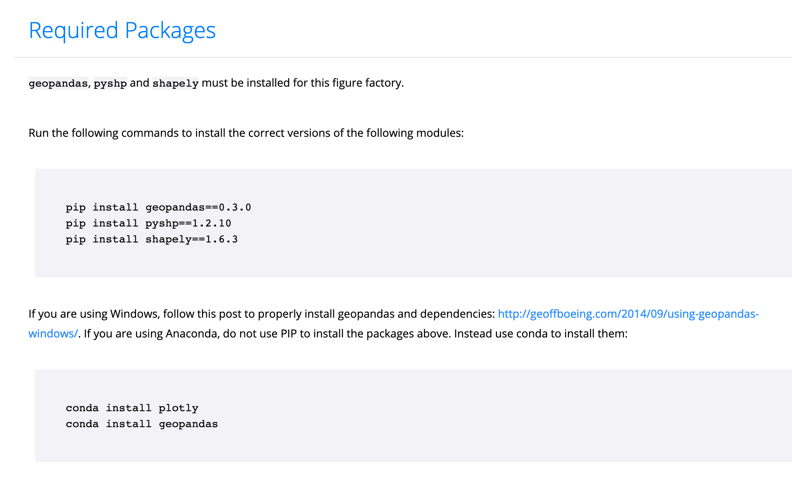

# Gun Violence Visualization 
This project is a part of the Lambda School Build Week March 2019

-- Project Status: [Completed]

# Project Intro/Objective
The purpose of this project is to create a web app that shows the impact of gun violence on the United States between 2014-2018. 
We created what we considered a somber theme and accompanying visuals to allow the user to really explore the entire country and the time period's history of gun violence.

# Methods Used
Inferential Statistics  
Data Visualization  
Predictive Modeling

# Technologies
## Python
 -- Pandas, Jupyter, MatPlotLib, Seaborn, Plotly, Folium, Numpy, Geopy

# Needs of this project
Frontend developer to integrate visuals and provide a layout for theme/color scheme and integrating content.  
Backend developer for securing endpoints, authenticated login, and routing.  
Data exploration/descriptive statistics  
Data processing/cleaning  
Statistical modeling  
Writeup/Reporting  

# Getting Started
Clone this repo

Raw Data is being kept [here](https://www.kaggle.com/jameslko/gun-violence-data) on Kaggle.

To obtain this data you will need to sign up for a Kaggle account and download the data from the webpage. 
You will also need to create a Plotly account if you wish to save these visualizations offline.
If you plan to use these visualizations offline, you must replace the credentials of these notebooks with your own.
Please refer to https://plot.ly/python/getting-started/ for more information.

Data processing/transformation scripts are built into the accompanying juypter notebooks.
Specifically, if you wish to recreate the county heat map, you will need to run fips_codes.py

It queries the US census's openly available API to map latitude/longitude to county.
Some of the data will be missing, as there are 41 independent cities in the United States, which do not have counties.
Most notably, Baltimore, Maryland. 

To use Plotly from a jupyter notebook, please use the following commands.  
  
